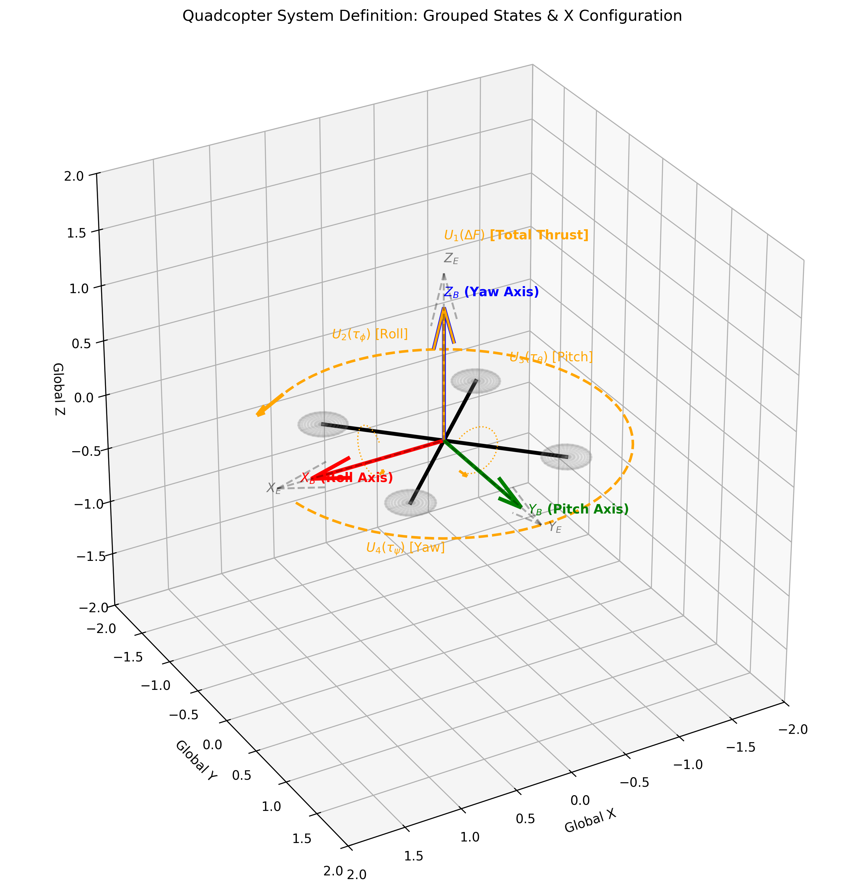

# Mathematical Formulation: 12-State Quadcopter Dynamics & Linear MPC

## 1. System Overview
This document outlines the mathematical modeling, state-space formulation, and Model Predictive Control (MPC) design for a quadcopter Unmanned Aerial Vehicle (UAV). The objective of the control system is to track predefined 3D spatial trajectories while respecting rigid body dynamics and hardware actuator constraints.

## 2. Mathematical Model

### 2.1 State and Input Definitions
The quadcopter is modeled as a 12-state system. The state vector $\mathbf{x} \in \mathbb{R}^{12}$ and the control input vector $\mathbf{u} \in \mathbb{R}^4$ are defined as:

$$\mathbf{x} = [x, y, z, u, v, w, \phi, \theta, \psi, p, q, r]^T$$
$$\mathbf{u} = [\Delta F, \tau_\phi, \tau_\theta, \tau_\psi]^T$$

**State Variables:**  

* $x, y, z$: Inertial positions (m)
* $u, v, w$: Linear velocities in the body frame (m/s)
* $\phi, \theta, \psi$: Euler angles representing roll, pitch, and yaw (rad)
* $p, q, r$: Angular velocities in the body frame (rad/s)

**Control Inputs:**  

* $\Delta F$: Difference in total thrust from the hover state (N). Total thrust is $F_{total} = mg + \Delta F$.
* $\tau_\phi, \tau_\theta, \tau_\psi$: Control torques about the body x, y, and z axes (N·m).

**Figure 1:** Quadcopter "X" configuration body frame definition and virtual control input mapping.**

### 2.2 Nonlinear Newton-Euler Dynamics

The true physics of the quadcopter are governed by highly coupled, nonlinear 2nd-order ordinary differential equations (ODEs). Let $U_1$ be the total absolute thrust ($F_{total}$), and $U_2, U_3, U_4$ be the torques ($\tau_\phi, \tau_\theta, \tau_\psi$).

**Translational Dynamics:**  

$$\ddot{x} = (\cos\phi\sin\theta\cos\psi + \sin\phi\sin\psi)\frac{U_1}{m}$$

$$\ddot{y} = (\cos\phi\sin\theta\sin\psi - \sin\phi\cos\psi)\frac{U_1}{m}$$

$$\ddot{z} = -g + (\cos\phi\cos\theta)\frac{U_1}{m}$$

**Rotational Dynamics:**  

$$\ddot{\phi} = \dot{\theta}\dot{\psi}\left(\frac{I_{yy} - I_{zz}}{I_{xx}}\right) + \frac{J_r}{I_{xx}}\dot{\theta}\Omega + \frac{U_2}{I_{xx}}$$

$$\ddot{\theta} = \dot{\phi}\dot{\psi}\left(\frac{I_{zz} - I_{xx}}{I_{yy}}\right) - \frac{J_r}{I_{yy}}\dot{\phi}\Omega + \frac{U_3}{I_{yy}}$$

$$\ddot{\psi} = \dot{\phi}\dot{\theta}\left(\frac{I_{xx} - I_{yy}}{I_{zz}}\right) + \frac{U_4}{I_{zz}}$$

(Note: $\Omega$ represents the residual propeller gyroscopic momentum, and $J_r$ is the rotor inertia).

### 2.3 Nonlinear State-Space Representation
To transition from 2nd-order differential equations to a format suitable for control design, the system is rewritten as twelve 1st-order differential equations in the nonlinear state-space form:

$$\dot{\mathbf{x}} = f(\mathbf{x}, \mathbf{u})$$

By mapping the 2nd-order translational and rotational accelerations to the derivatives of our specific grouped state vector $\mathbf{x}$, the nonlinear function $f(\mathbf{x}, \mathbf{u})$ is defined as:

$$ f(\mathbf{x}, \mathbf{u}) = \begin{bmatrix} 
u \\
v \\
w \\
(\cos\phi\sin\theta\cos\psi + \sin\phi\sin\psi)\frac{U_1}{m} \\
(\cos\phi\sin\theta\sin\psi - \sin\phi\cos\psi)\frac{U_1}{m} \\
-g + (\cos\phi\cos\theta)\frac{U_1}{m} \\
p \\
q \\
r \\
qr\left(\frac{I_{yy} - I_{zz}}{I_{xx}}\right) - \frac{J_r}{I_{xx}}q\Omega + \frac{U_2}{I_{xx}} \\
pr\left(\frac{I_{zz} - I_{xx}}{I_{yy}}\right) + \frac{J_r}{I_{yy}}p\Omega + \frac{U_3}{I_{yy}} \\
pq\left(\frac{I_{xx} - I_{yy}}{I_{zz}}\right) + \frac{U_4}{I_{zz}}
\end{bmatrix} $$

### 2.4 Linearization at Hover State

To implement linear MPC, we apply a Taylor series first-order expansion around a stable hover equilibrium point. 

**Hover Assumptions:**  

1.  **Small Angles:** Roll and pitch are near zero ( $\phi \approx 0, \theta \approx 0, \psi \approx 0$ ). Therefore, $\cos(0) \approx 1$ and $\sin(\alpha) \approx \alpha$.
2.  **Zero Velocity:** Angular velocities are near zero. Cross-coupled terms ( $\dot{\theta}\dot{\psi}$ ) and gyroscopic rotor drag terms ( $\dot{\theta}\Omega$ ) approach zero and are removed.
3.  **Thrust Equivalency:** At hover, total thrust equals gravity ($U_1 = mg + \Delta F$).

**Deriving the Linearized Equations:**  

Applying these assumptions to the nonlinear equations yields the simplified linear dynamics:
* **X-Axis:**  
  $$\ddot{x} = (1 \cdot \theta \cdot 1 + 0)\frac{mg}{m} \Rightarrow \ddot{x} = g\theta$$

  (Note: In our specific coordinate frame implementation, pitch-up yields negative X acceleration, so we define $\dot{u} = -g\theta$ ).  

* **Y-Axis:**   
  $$\ddot{y} = (1 \cdot 0 \cdot 0 - \phi \cdot 1)\frac{mg}{m} \Rightarrow \ddot{y} = -g\phi$$

  (Implemented as $\dot{v} = g\phi$ depending on left/right hand coordinate orientation).  

* **Z-Axis:**   

  $$\ddot{z} = -g + (1 \cdot 1)\frac{mg + \Delta F}{m} \Rightarrow \ddot{z} = \frac{\Delta F}{m}$$  
* **Rotations:** With cross-coupling removed,  

  $$\ddot{\phi} = \frac{\tau_\phi}{I_{xx}}$$

  $$\ddot{\theta} = \frac{\tau_\theta}{I_{yy}}$$

  $$\ddot{\psi} = \frac{\tau_\psi}{I_{zz}}$$

**Linearization via Jacobian:**  

The linear system matrices $A$ and $B$ are formally derived by taking the Jacobians of $f(\mathbf{x}, \mathbf{u})$ evaluated at the hover equilibrium point $ x_{eq} = 0, U_{1,eq} = mg $ :

$$A = \left. \frac{\partial f(\mathbf{x}, \mathbf{u})}{\partial \mathbf{x}} \right|_{\mathbf{x}_{eq}, \mathbf{u}_{eq}}$$
$$B = \left. \frac{\partial f(\mathbf{x}, \mathbf{u})}{\partial \mathbf{u}} \right|_{\mathbf{x}_{eq}, \mathbf{u}_{eq}}$$

### 2.5 Linearized State-Space Representation

By splitting the 2nd-order ODEs into twelve 1st-order equations ( $\dot{x} = u$, $\dot{u} = -g\theta$, etc.), we construct the continuous-time Linear Time-Invariant (LTI) system:

$$\dot{\mathbf{x}} = A\mathbf{x} + B\mathbf{u}$$
$$\mathbf{y} = C\mathbf{x} + D\mathbf{u}$$

**Sensor Output Assumption:**   

The output equation defines what the sensors can physically measure ($\mathbf{y}$). For this implementation, we assume **full state feedback** (perfect observation of all 12 states without sensor noise). Therefore, the observation matrix $C$ is a $12 \times 12$ Identity matrix ($I_{12 \times 12}$) and the feedforward matrix $D$ is a zero matrix.

**System Matrix ($A \in \mathbb{R}^{12 \times 12}$):**  

$$A = \begin{bmatrix} 
0 & 0 & 0 & 1 & 0 & 0 & 0 & 0 & 0 & 0 & 0 & 0 \\
0 & 0 & 0 & 0 & 1 & 0 & 0 & 0 & 0 & 0 & 0 & 0 \\
0 & 0 & 0 & 0 & 0 & 1 & 0 & 0 & 0 & 0 & 0 & 0 \\
0 & 0 & 0 & 0 & 0 & 0 & 0 & -g & 0 & 0 & 0 & 0 \\
0 & 0 & 0 & 0 & 0 & 0 & g & 0 & 0 & 0 & 0 & 0 \\
0 & 0 & 0 & 0 & 0 & 0 & 0 & 0 & 0 & 0 & 0 & 0 \\
0 & 0 & 0 & 0 & 0 & 0 & 0 & 0 & 0 & 1 & 0 & 0 \\
0 & 0 & 0 & 0 & 0 & 0 & 0 & 0 & 0 & 0 & 1 & 0 \\
0 & 0 & 0 & 0 & 0 & 0 & 0 & 0 & 0 & 0 & 0 & 1 \\
0 & 0 & 0 & 0 & 0 & 0 & 0 & 0 & 0 & 0 & 0 & 0 \\
0 & 0 & 0 & 0 & 0 & 0 & 0 & 0 & 0 & 0 & 0 & 0 \\
0 & 0 & 0 & 0 & 0 & 0 & 0 & 0 & 0 & 0 & 0 & 0 
\end{bmatrix}$$

**Input Matrix ($B \in \mathbb{R}^{12 \times 4}$):**  

$$B = \begin{bmatrix} 
0 & 0 & 0 & 0 \\
0 & 0 & 0 & 0 \\
0 & 0 & 0 & 0 \\
0 & 0 & 0 & 0 \\
0 & 0 & 0 & 0 \\
\frac{1}{m} & 0 & 0 & 0 \\
0 & 0 & 0 & 0 \\
0 & 0 & 0 & 0 \\
0 & 0 & 0 & 0 \\
0 & \frac{1}{I_{xx}} & 0 & 0 \\
0 & 0 & \frac{1}{I_{yy}} & 0 \\
0 & 0 & 0 & \frac{1}{I_{zz}} 
\end{bmatrix}$$

## 3. Model Predictive Control (MPC) Formulation
The MPC calculates the optimal control sequence by solving a Quadratic Program (QP) over a finite prediction horizon $N$. 

**Figure 2: Closed-loop Model Predictive Control architecture utilizing full state feedback.**

### 3.1 Objective Function & Constraints
At each time step, the controller minimizes a cost function $J$, subject to the discretized system dynamics ($\mathbf{x}_{k+1} = A_d\mathbf{x}_k + B_d\mathbf{u}_k$) and physical actuator limits.

$$\min_{\mathbf{x}_{0:N}, \mathbf{u}_{0:N-1}} \sum_{k=0}^{N-1} (\mathbf{x}_{k} - \mathbf{r}_{k})^T Q (\mathbf{x}_{k} - \mathbf{r}_{k}) + \Delta\mathbf{u}_{k}^T R \Delta\mathbf{u}_{k}$$

**Subject to:**   

$$\mathbf{x}_0 = \mathbf{x}_{current}$$

$$\mathbf{x}_{k+1} = A_d \mathbf{x}_k + B_d \mathbf{u}_k$$

$$\mathbf{u}_{min} \leq \mathbf{u}_k \leq \mathbf{u}_{max}$$

**Where:**   
* $Q$: State error penalty matrix.
* $R$: Control effort increment penalty matrix ( penalizes $\Delta u_k = u_k - u_{k-1}$ to prevent aggressive actuator chatter ).
* $r_k$: The reference state vector at step $k$.

### 3.2 Physical Actuator Constraints
The control inputs are strictly bounded by the physical geometry and motor capabilities of the specific UAV. Using the max absolute thrust per motor ($F_{max}$), drone mass ($m$), and arm length ($L$), the limits are calculated as:

* $\max(\Delta F) = (4 \cdot F_{max}) - mg$
* $\max(\tau_\phi, \tau_\theta) = F_{max} \cdot L$

## 4. Trajectory Generation & Global Unwrapping
The reference trajectory $\mathbf{r}_k$ dictates the flight path. For complex paths crossing Cartesian axes (like a Lemniscate), the mathematical heading (yaw) naturally crosses the $\pm \pi$ boundary. 

To prevent the linear solver from calculating artificial $360^\circ$ errors at these boundaries, the target yaw angle is globally unwrapped from $t=0$ to $t=t_{final}$ before being sliced into the $N$-step horizon array provided to the MPC objective function.

***

## 5. References

[1] T. Veness, *Controls Engineering in the FIRST Robotics Competition*. https://file.tavsys.net/control/controls-engineering-in-frc.pdf

[2] B. Landry, "Planning and control for quadrotor flight through cluttered environments," M.S. thesis, Dept. Elect. Eng. Comput. Sci., Massachusetts Institute of Technology, Cambridge, MA, USA, 2015. [Online]. Available: https://dspace.mit.edu/handle/1721.1/100608

[3] S. Bouabdallah, P. Murrieri, and R. Siegwart, "Design and Control of an Indoor Micro Quadrotor," in *Proceedings of the 2004 IEEE International Conference on Robotics and Automation (ICRA)*, New Orleans, LA, USA, 2004, pp. 4393-4398. https://ieeexplore.ieee.org/document/1302409

[4] S. K. Phang, K. Li, K. H. Yu, B. M. Chen, and T. H. Lee, "Systematic Design and Implementation of a Micro Unmanned Quadrotor System," *Unmanned Systems*, vol. 2, no. 2, pp. 121-141, 2014. https://doi.org/10.1142/S2301385014500083

[5] M. Hamer, L. Widmer, and R. D'Andrea, "Fast Generation of Collision-Free Trajectories for Robot Swarms Using GPU Acceleration," *IEEE Access*, vol. 7, pp. 6679-6690, 2019. https://ieeexplore.ieee.org/document/8587164

***