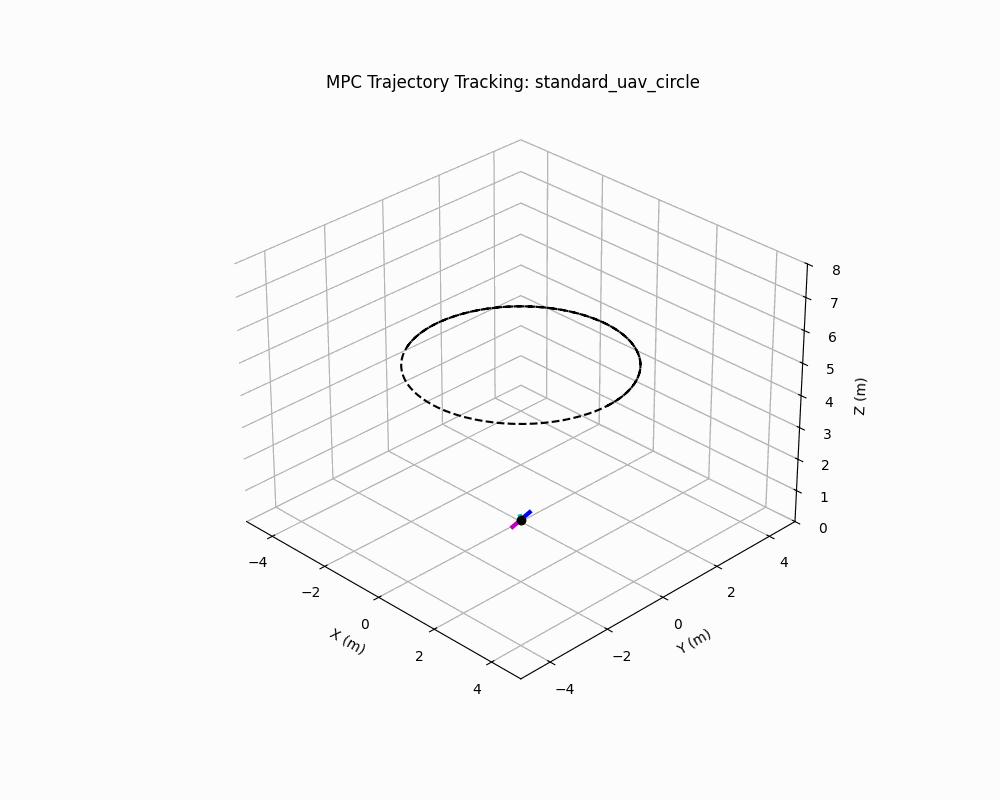
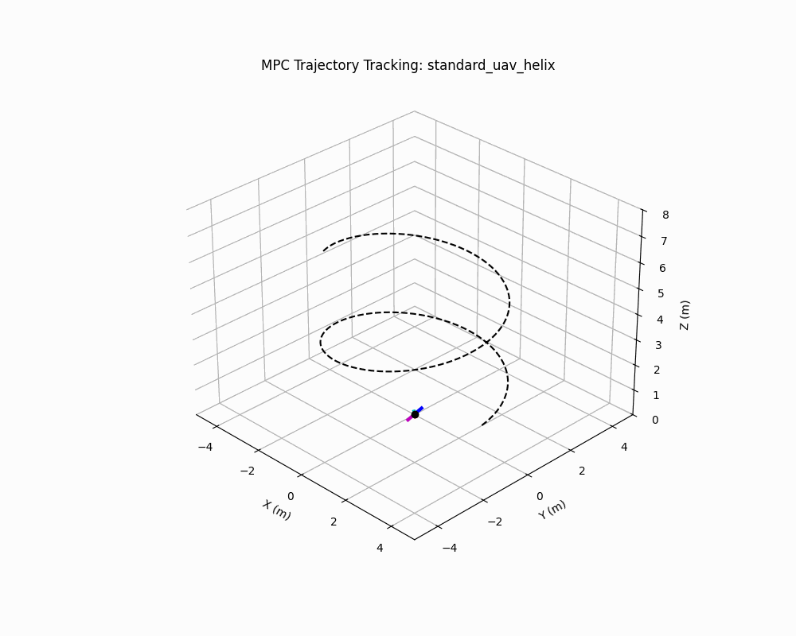
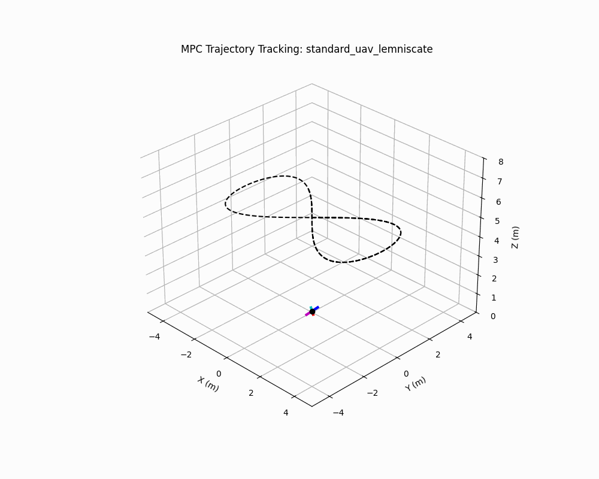
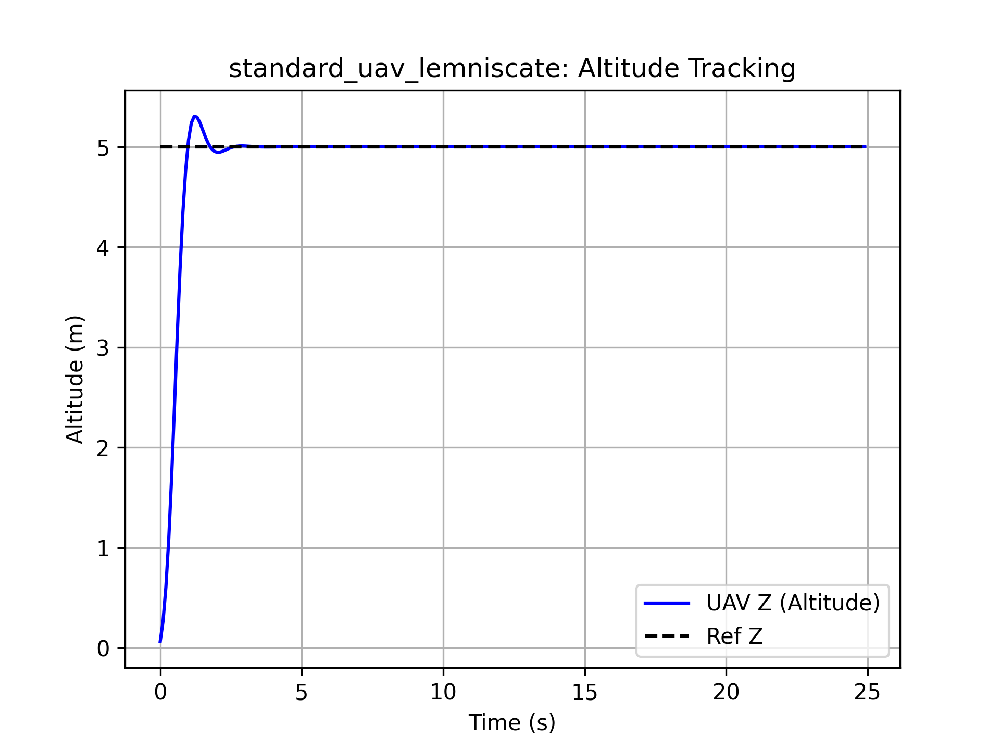
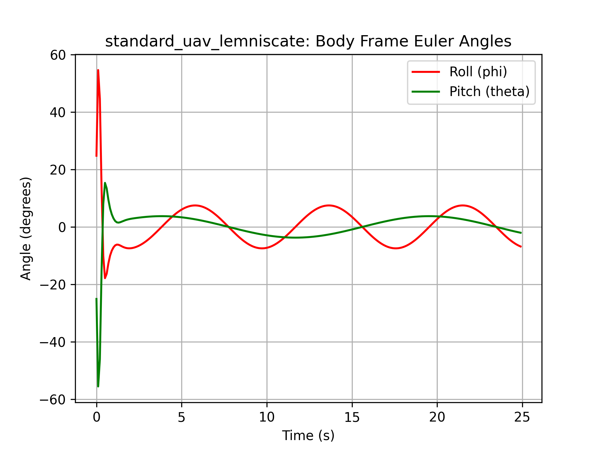

# MPC Quadcopter UAV Simulation

A fully modular, hardware-agnostic Model Predictive Control (MPC) simulation framework for Unmanned Aerial Vehicles (UAVs). This repository contains both a robust Python/CVXPY implementation and a MATLAB MPC Toolbox baseline.

The system proves the viability of tracking complex 3D trajectories (Circles, Helices, Figure-8s) using a linearized 12-state rigid body model, and is designed to act as a foundational sandbox for verifiable AI, reinforcement learning, and autonomous control research.

## Key Features

* **Hardware Parameterization:** Easily swap between UAV models (e.g., Crazyflie 2.1 vs. heavy payload drones) using a single configuration dictionary. The framework dynamically scales physical constraints (mass, inertia, arm length).
* **Multi-Trajectory Generation:** Built-in generators for continuous mathematically defined paths, including global angle unwrapping for complex curves.
* **Dynamic Asset Generation:** Automatically generates `.png` metrics, `.gif` loops, and 60fps `.mp4` 3D flight animations.
* **Dual-Environment:** Contains both Python (`cvxpy` optimization) and MATLAB formulations.

## Python Software Architecture

The Python framework is built using object-oriented principles to completely decouple the physics, the math, and the visualization.

* **`main_simulation.py`**: The orchestrator. Contains the `ROBOT_CONFIGS` library. It initializes the system, defines the $A$ and $B$ matrices, sets up the CVXPY optimization constraints, and runs the receding horizon loop.
* **`trajectory.py`**: The `TrajectoryGenerator` class. Takes in geometric parameters and returns an $N \times 12$ reference matrix for the MPC horizon. Currently supports `circle`, `helix`, and `lemniscate` modes.
* **`plotter.py`**: Generates individual, publication-ready scientific metric plots (Altitude Tracking, Euler Angles, Control Thrust) to prove system stability.
* **`animation.py`**: Renders the 3D 'X' configuration quadcopter simulation. Features a fixed camera angle, path tracing, color-coded arms to verify heading stability, and dynamic file exporting.

*(Note: All generated assets are automatically saved to a relative `/output/` directory created dynamically at runtime).*

## Requirements

**For Python:**  
* Python 3.8+
* `numpy`
* `scipy` (for continuous-to-discrete system conversions)
* `cvxpy` (OSQP solver for the MPC)
* `matplotlib` (for 3D rendering and plotting)
* *Optional but highly recommended:* `ffmpeg` installed on your system PATH for `.mp4` generation.

**For MATLAB:**  
* MATLAB R2019a or later
* Control System Toolbox
* Model Predictive Control Toolbox

## Installation & Usage

### Running the Python Framework 
1. Clone the repository and install the dependencies:
   ```bash
   pip install numpy scipy cvxpy matplotlib
   ```
2. Open `main_simulation.py`.
3. Under the `EXPERIMENT SETUP` block, choose the hardware and path:
   ```python
   active_robot = 'crazyflie_2_1'         # Options: 'crazyflie_2_1', 'standard_uav'
   active_trajectory = 'lemniscate'       # Options: 'circle', 'helix', 'lemniscate'
   ```
4. Run the simulation:
   ```bash
   python main_simulation.py
   ```
5. Check the newly created `output/` folder for the dynamically named plots and videos.

### Running the MATLAB Baseline 
1. Open MATLAB and navigate to the repository folder.
2. Open `mpc_quadcopter_simulation.m`.
3. Run the script. The `.fig` animation will play in a new window, and the script will utilize MATLAB's `VideoWriter` and `imwrite` to output `.mp4` and `.gif` files directly to your working directory.

## Simulation Results

### 3D Trajectory Tracking
| Circular Path | Helical Climb | Lemniscate (Figure-8) |
| :---: | :---: | :---: |
|  |  |  |

### Scientific Metrics (Lemniscate Tracking)
The following plots demonstrate the MPC's ability to maintain stability and strict constraint adherence during aggressive trajectory reversals.

| Altitude Tracking | Body Frame Euler Angles |
| :---: | :---: |
|  |  |

*(Note: Full metric plots for all configurations, including control thrust limits, are available in the `./python/output/` directory).*

## Documentation & Theory 

For a complete derivation of the 12-state LTI system, the Newton-Euler rigid body dynamics, and the exact mathematical formulation of the Quadratic Program solved by the MPC, please refer to the [`Formulation.md`](Formulation.md) file in this repository.

